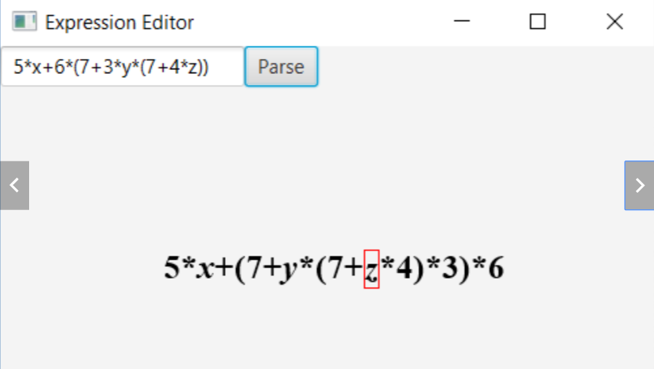

# Mathematical Expression Editor

For this project, we built an interactive (event-driven) mathematical expression editor with a simple graphical user interface (GUI). 

## Description
The Expression Editor built will allow user to type in a mathematical expression, which will then be parsed into an "expression tree" and then displayed graphically. 

Afterwards, the user will be able to drag-and-drop different subexpressions -- at __arbitrary levels of granuliarity__ -- so as to rearrange the expression __while perserving the same mathematical semantics__. 

## Demo 
1. User enters mathematical expression and click 'Parse' button. 

2. User click on an expression to "focus" on a sub-expression. 

3. A sub-expression is moved around, without violating any mathematical rules. 

## Main process
1. Build a parser:
- Our major task in this assignment was to build a __recursive descent parser__, based on a __context-free grammar__, to convert a string -- e.g., 10*x*z + 2*(15+y) -- into a parse tree that captures the expression's mathematical meaning. 
- Context-free grammer used:
    - E → A | X
    - A → A+M | M
    - M → M*M | X
    - X → (E) | L
    - L → [a-z] | [0-9]+  
- Example: 

1. Implement different types of expressions (addition, multiplication, etc). 
2. Flattening the Parsed Tree: 
- Instead of having just a binary tree, we would flatten it as much as possible into an arbitrary-arity tree. 
- Example: 

3. Code the GUI: 
- Allow users to enter a mathematical expression of their choice. 
- Display the valid mathematical expression entered on the screen. 
- Allow users to "drag-and-drop" to modify the expression, yet still maintain the proper mathematical rules. 

## Authors
- Dung (Kevin) Nguyen - Computer Science student at Worcester Polytechnic Institute
- Ryan Johnson - Computer Science student at Worcester Polytechnic Institute
- Nicholas Alescio - Computer Science student at Worcester Polytechnic Institute

## Acknowledgement
This project was initiated and supervised by Professor Jacob Whitehill at Worcester Polytechnic Institute. His focus is in machine learning and artificial intelligence.

